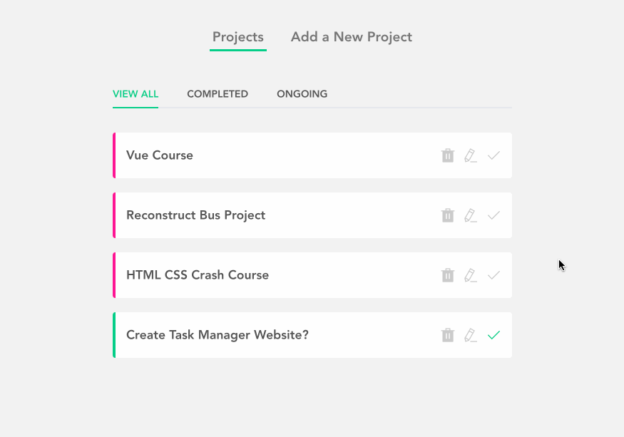

# Vue-project-planner

來自 [Build Web Apps with Vue JS 3 & Firebase](https://www.udemy.com/course/build-web-apps-with-vuejs-firebase/) 的其中一項專案。主要拿來練習 Vue 的基礎應用。

這份專案有兩個分支，分別為：

master（自己想的版本）
review（課程解答的版本）

網站連結：https://jubeatt.github.io/Vue-project-planner

## 網站介紹

- 檢視任務列表
- 新增任務
- 編輯任務
- 刪除任務
- 自動儲存紀錄（localStorage）



## 使用技術

- Vue3 (CLI)
- Vue-router
- Element plus

使用到的技術不多，不過對於 Vue 的概念有越來越上手的感覺，像是 `computed` 和 `watch` 的應用時機，以及 lifecycle hook 的概念。

總之是一份收穫蠻多的專案，所以想記錄下來。

## 運行方式

1. 把專案 clone 下來後安裝依賴項目：

```bash
npm install
```

2. 啟動開發環境：

```bash
npm run serve
```

## 打包

```bash
npm run build
```

之後再透過 live-sever 的方式打開 `/dist/index.html` 即可
